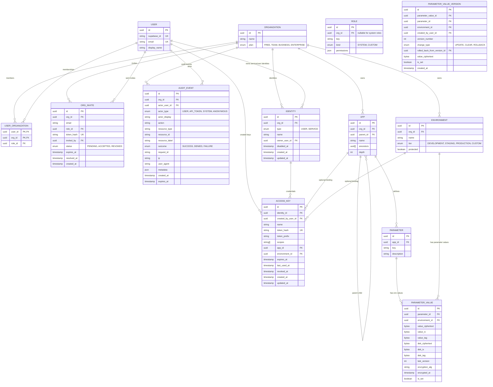

# Current ER Model

Last updated: 2026-05-11.

This document describes the implemented Prisma schema, not aspirational billing/SSO models.



## Invariants

1. `User.role` and `User.organizationId` do not exist. Memberships store `roleId` and resolve permissions through `Role`.
2. `Organization.members` is the join-table relation; there is no direct `Organization.users` relation.
3. `App.ancestors` is a materialized root-to-parent path. The app itself is not included.
4. `Parameter.key` is unique per app.
5. `ParameterValue` is unique per `(parameterId, environmentId)`.
6. `ParameterValue.value` no longer exists. Values are encrypted at rest.
7. `ParameterValue.isSet=false` means unset locally / inherit from ancestors.
8. All parameter values are secret-by-default. `Environment.protected` and `Environment.tier` are RBAC conditions for reveal/write authorization.
9. `OrgInvite.tokenHash` stores only a SHA-256 fingerprint of the raw email token.
10. `AccessKey.tokenHash` stores only a SHA-256 fingerprint of the full raw access key. The raw token is shown once at creation.
11. `AccessKey.tokenPrefix` stores the non-secret `mull_pat_<keyId>` or `mull_st_<keyId>` prefix for display, audit, and support.
12. Access keys may be bound to one app and/or one environment; those bindings must belong to the same organization as the identity.
13. `AuditEvent.metadata` must not contain plaintext parameter values, raw invite tokens, raw access keys, or full credentials.
14. Audit retention is stored per row in `expiresAt`; Postgres function `prune_expired_audit_events()` deletes expired rows and is scheduled through `pg_cron` when available.

## Config Inheritance View

`config_inheritance` is a SQL view, not a Prisma model. It expands app ancestry and returns the winning encrypted value row for each `(app, org, environment, key)`.

Important behavior:

```sql
WHERE pv.is_set = true
```

Unset local values are omitted before ranking, so a blank child value does not shadow a set ancestor value. Because of that filter, `is_set` is always true for rows returned by the view.

The backend decrypts returned rows in Node after the view has resolved inheritance.

## Access Key Identity Model

Access keys are implemented with a two-layer model:

- `Identity` is the actor: either a user identity or a service identity.
- `AccessKey` is the credential used to authenticate that identity.
- PATs use `mull_pat_<keyId>_<secret>` and authenticate a user identity.
- Service tokens use `mull_st_<keyId>_<secret>` and authenticate a service identity owned by an organization.
- `request.auth` is the runtime contract for auth/authorization. `request.user` remains for compatibility.

See [Access Key Identity Walkthrough](access-key-identity-walkthrough.md) for the request flow and route policy.

## Planned But Not Implemented

These concepts are product/backlog items and are intentionally absent from the current schema:

- OIDC/workload identity auth methods
- SSO connections
