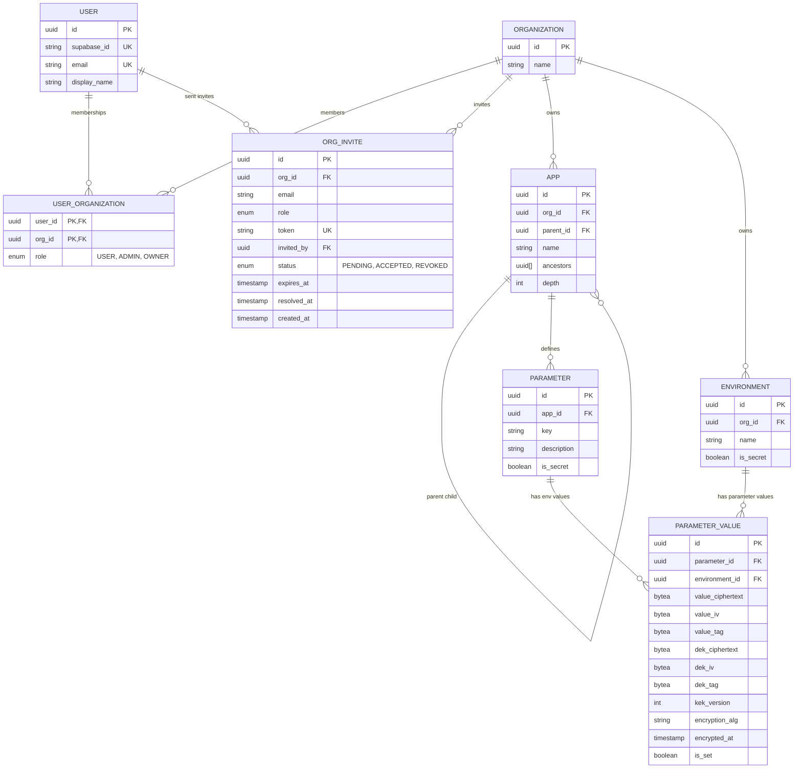

# Current ER Model

Last updated: 2026-05-09.

This document describes the implemented Prisma schema, not the aspirational billing/token/audit model.



## Invariants

1. `User.role` and `User.organizationId` do not exist. Membership and role are stored in `UserOrganization`.
2. `Organization.members` is the join-table relation; there is no direct `Organization.users` relation.
3. `App.ancestors` is a materialized root-to-parent path. The app itself is not included.
4. `Parameter.key` is unique per app.
5. `ParameterValue` is unique per `(parameterId, environmentId)`.
6. `ParameterValue.value` no longer exists. Values are encrypted at rest.
7. `ParameterValue.isSet=false` means unset locally / inherit from ancestors.
8. `Environment.isSecret || Parameter.isSecret` makes a value secret for read authorization.

## Config Inheritance View

`config_inheritance` is a SQL view, not a Prisma model. It expands app ancestry and returns the winning encrypted value row for each `(app, org, environment, key)`.

Important behavior:

```sql
WHERE pv.is_set = true
```

Unset local values are omitted before ranking, so a blank child value does not shadow a set ancestor value. Because of that filter, `is_set` is always true for rows returned by the view.

The backend decrypts returned rows in Node after the view has resolved inheritance.

## Planned But Not Implemented

These concepts are product/backlog items and are intentionally absent from the current schema:

- API/service tokens
- audit log
- parameter value version history
- billing/subscription tables
- SSO connections
