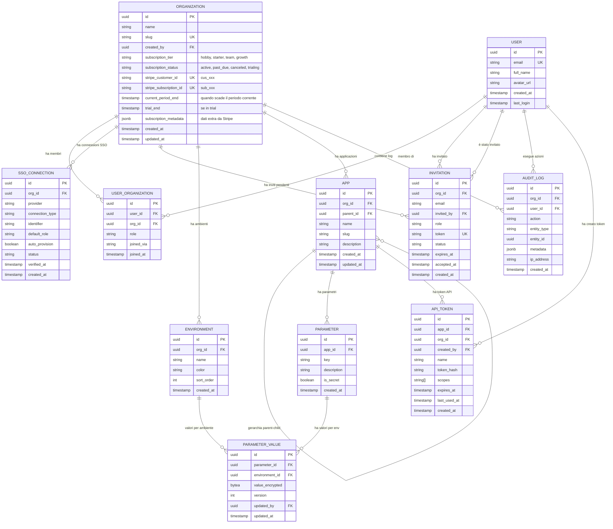

```mermaid 

erDiagram
    ORGANIZATION ||--o{ USER_ORGANIZATION : "ha membri"
    ORGANIZATION ||--o{ SSO_CONNECTION : "ha connessioni SSO"
    ORGANIZATION ||--o{ INVITATION : "ha inviti pendenti"
    USER ||--o{ USER_ORGANIZATION : "membro di"
    USER ||--o{ INVITATION : "ha invitato"
    USER ||--o{ INVITATION : "è stato invitato"
    ORGANIZATION ||--o{ ENVIRONMENT : "ha ambienti"
    ORGANIZATION ||--o{ APP : "ha applicazioni"
    APP ||--o{ APP : "gerarchia parent-child"
    APP ||--o{ PARAMETER : "ha parametri"
    PARAMETER ||--o{ PARAMETER_VALUE : "ha valori per env"
    ENVIRONMENT ||--o{ PARAMETER_VALUE : "valori per ambiente"
    USER ||--o{ AUDIT_LOG : "esegue azioni"
    ORGANIZATION ||--o{ AUDIT_LOG : "contiene log"
    APP ||--o{ API_TOKEN : "ha token API"
    USER ||--o{ API_TOKEN : "ha creato token"

    USER {
        uuid id PK
        string email UK
        string full_name
        string avatar_url
        timestamp created_at
        timestamp last_login
    }

    ORGANIZATION {
        uuid id PK
        string name
        string slug UK
        uuid created_by FK
        string subscription_tier "hobby, starter, team, growth"
        string subscription_status "active, past_due, canceled, trialing"
        string stripe_customer_id UK "cus_xxx"
        string stripe_subscription_id UK "sub_xxx"
        timestamp current_period_end "quando scade il periodo corrente"
        timestamp trial_end "se in trial"
        jsonb subscription_metadata "dati extra da Stripe"
        timestamp created_at
        timestamp updated_at
    }

    USER_ORGANIZATION {
        uuid id PK
        uuid user_id FK
        uuid org_id FK
        string role
        string joined_via
        timestamp joined_at
    }

    SSO_CONNECTION {
        uuid id PK
        uuid org_id FK
        string provider
        string connection_type
        string identifier
        string default_role
        boolean auto_provision
        string status
        timestamp verified_at
        timestamp created_at
    }

    INVITATION {
        uuid id PK
        uuid org_id FK
        string email
        uuid invited_by FK
        string role
        string token UK
        string status
        timestamp expires_at
        timestamp accepted_at
        timestamp created_at
    }

    ENVIRONMENT {
        uuid id PK
        uuid org_id FK
        string name
        string color
        int sort_order
        timestamp created_at
    }

    APP {
        uuid id PK
        uuid org_id FK
        uuid parent_id FK
        string name
        string slug
        string description
        timestamp created_at
        timestamp updated_at
    }

    PARAMETER {
        uuid id PK
        uuid app_id FK
        string key
        string description
        boolean is_secret
        timestamp created_at
    }

    PARAMETER_VALUE {
        uuid id PK
        uuid parameter_id FK
        uuid environment_id FK
        bytea value_encrypted
        int version
        uuid updated_by FK
        timestamp updated_at
    }

    AUDIT_LOG {
        uuid id PK
        uuid org_id FK
        uuid user_id FK
        string action
        string entity_type
        uuid entity_id
        jsonb metadata
        string ip_address
        timestamp created_at
    }

    API_TOKEN {
        uuid id PK
        uuid app_id FK
        uuid org_id FK
        uuid created_by FK
        string name
        string token_hash
        string[] scopes
        timestamp expires_at
        timestamp last_used_at
        timestamp created_at
    }
```
